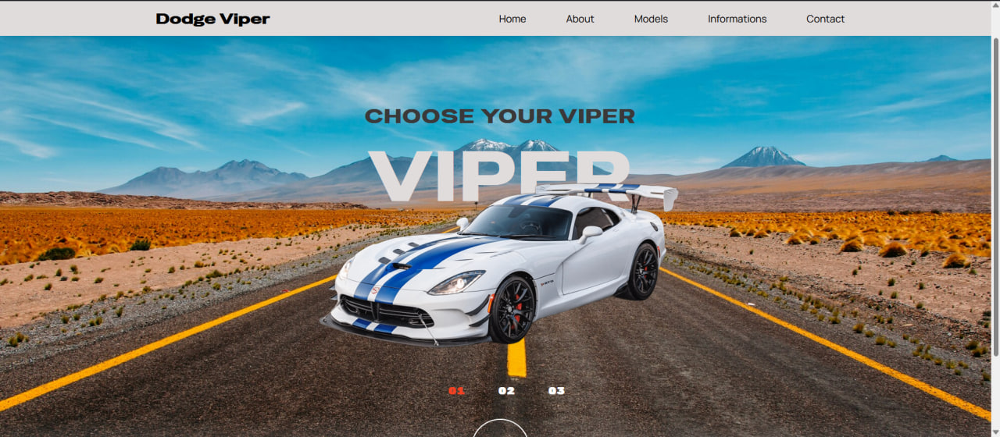

# Home Page with Swiper
Главная страница лендинга для автомобиля Dodge Viper, включающая свайпер. 
Создана в рамках обучения и как часть портфолио frontend-разработчика.

---

## О проекте 

<p align="center"></p>

<h3> Главная страница для автомобиля Dodge Viper с современным дизайном и адаптивной версткой. Основные особенности: </h3>

```javascript

const about = 
{
   - Анимации и интерактивные элементы

   - Адаптивность под мобильные устройства

   - Карусель изображений (Swiper)

   - Эффекты при скролле

   - Плавная навигация по странице
}
```


---

## Технологии

   - HTML5 - семантическая разметка

   - CSS3 - Flexbox, кастомные шрифты, анимации

   - JavaScript - логика взаимодействия

   - Библиотеки:

        Swiper - карусель изображений

        Remix Icon - иконки

---
## Ключевые функции

    Адаптивное меню:

        Гамбургер-меню на мобильных устройствах

        Плавное открытие/закрытие

        Автоматическое закрытие при клике на пункт

   


    Эффекты шапки:

        Изменение фона при скролле

        Тень при прокрутке

    Карусель Swiper:

        Пагинация с кастомным дизайном

        Автопрокрутка (раскомментировать в коде)

        3 слайда с изображениями авто

   

---
